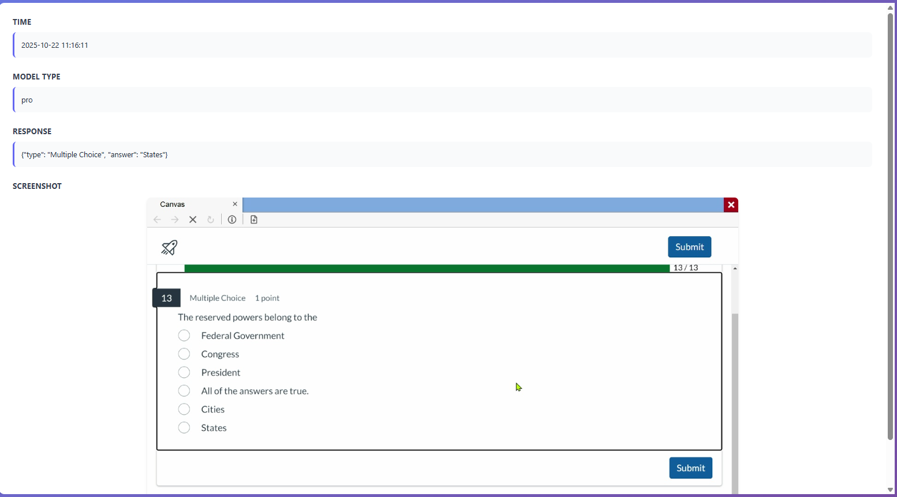

# disable-lockdown-browser
Disable lockdown for lockdown browser. Works on Windows, Mac, Linux, Chromebook, Managed Computer, etc. 

View details here: https://lockdown-browser-bypass.vercel.app

# Features
- Undetectable - Even if program crashes, you will NEVER be flagged or banned
- Screenshot capture - Capture screenshot
- Video recording - Recording playback to review later
- Bypass screen recording - Some teachers enable screen recording. You will be caught with other solutions. This one can't be detected
- AI mode - Custom AI Mode so you never have to switch out of the window 
- Questions or other info? Contact me

# Demo

# AI Mode
Auto screenshot and ai response overlay, great for multiple choice questions!

# Dev Branch
Need premium version or trial run? Contact below.

# Contact
Discord: tavern_12021

